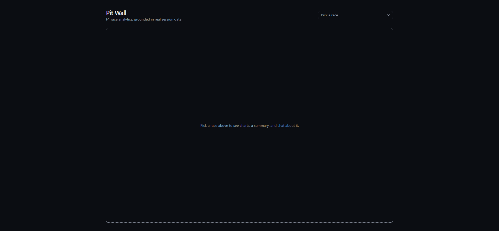

# Pit Wall — F1 Race Analytics Assistant

Pit Wall lets you pick any past Formula 1 session and understand what actually
happened in it. Choose a race and you get interactive charts of the on-track
action, a written recap, a chat assistant you can ask follow-up questions, and a
machine-learning model that estimates qualifying pace — every number in it pulled
from real timing data, never guessed or made up.

It's a portfolio project that ties together a few things end to end: a data
pipeline over a public F1 timing API, a small PyTorch model with proper
evaluation and explainability, and an LLM assistant that answers by calling real
data-lookup tools instead of relying on its own memory.

<!-- TODO: replace with an up-to-date screenshot or a short GIF of the app -->


<!-- TODO: add the live demo link here once deployed -->
<!-- **[Live demo »](https://your-deployment-url)** -->

---

## Features

- **Race selector** — browse seasons and pick any Practice, Qualifying, Sprint, or Race session that the data source covers (2023 onward).
- **Interactive charts** — lap-time deltas, position changes lap by lap, tyre-strategy timelines, pit stops, weather, intervals, track layout, and per-lap car telemetry, all built from real [OpenF1](https://openf1.org) session data.
- **Chat assistant ("Pit Wall")** — ask about tyre strategy, pit windows, who gained places, why a driver dropped back. The assistant answers by calling data-lookup tools against the real session, and explains F1 jargon as it goes.
- **Auto-generated race summaries** — a headline plus a page-long recap of the session, written by an LLM that only ever sees the verified data we hand it (race-control messages, lap times, stints, results) — so it can't invent events.
- **Qualifying prediction with explainability** — a PyTorch model estimates each driver's qualifying lap time from practice pace, recent form, weather, and tyre choice. Every prediction can be broken down into which inputs pushed the number up or down (Captum Integrated Gradients), and the model is always presented with its uncertainty stated plainly.

## Tech stack

**Frontend** — React 19, Vite, TypeScript, Tailwind CSS v4, shadcn/ui, Recharts, TanStack Query.

**Backend** — Python, FastAPI, SQLite, pandas.

**Machine learning** — PyTorch (feedforward model with entity embeddings), Optuna (hyperparameter search), Captum (attribution), MLflow (local experiment tracking).

**LLM layer** — Azure AI Foundry / Azure OpenAI via the `openai` SDK, using function/tool calling for structured race data and a retrieval-augmented (RAG) knowledge base — Chroma vector store — for conceptual F1 questions. Evaluated with `azure-ai-evaluation`.

**Data** — [OpenF1](https://openf1.org), a free public F1 timing API.

A deeper write-up of how these fit together and why each choice was made is in
**[`f1-race-analytics/docs/ARCHITECTURE.md`](f1-race-analytics/docs/ARCHITECTURE.md)**.

## Getting started

The application lives in the [`f1-race-analytics/`](f1-race-analytics/) directory.

### Prerequisites

- **Python 3.12** (3.10+ should work) and **Node.js 20+**
- An **Azure AI Foundry** or **Azure OpenAI** resource with a chat model and an embedding model deployed — required for the summary, chat, and knowledge-base features. The race selector and charts work without it.

### 1. Clone and enter the project

```bash
git clone https://github.com/EliDehaene01/FormulaOne.git
cd FormulaOne/f1-race-analytics
```

### 2. Backend dependencies

```bash
python -m venv .venv
# Windows:  .venv\Scripts\activate
# macOS/Linux:  source .venv/bin/activate
pip install -r backend/requirements.txt
```

### 3. Environment variables

```bash
cp backend/.env.example backend/.env
```

Open `backend/.env` and fill in your Azure values. Every variable is documented
in [`backend/.env.example`](f1-race-analytics/backend/.env.example) — you need
the endpoint, an API key, your chat deployment name, and your embedding
deployment name. `backend/.env` is gitignored; never commit it.

### 4. Fetch race data

```bash
python -m backend.data.ingest --years 2024 2025
```

This pulls sessions from OpenF1 into a local SQLite cache
(`backend/storage/cache.sqlite`). It's deliberately rate-limited, so a full
season takes a few minutes — add `--limit 2` for a quick trial run, or
`--session-types Race Qualifying` to skip practice sessions.

### 5. Build the knowledge base index

```bash
python -m backend.rag.build_index
```

Embeds `backend/knowledge_base/*.md` into a local Chroma store for the chat
assistant's conceptual-question tool. Needs the Azure embedding deployment
configured in step 3.

### 6. (Optional) Train the qualifying model

A trained `backend/storage/qualifying_model.pt` is included, so the prediction
feature works out of the box. To retrain it yourself:

```bash
python -m backend.models.train          # single run with default hyperparameters
python -m backend.models.tune           # 50-trial Optuna search, retrains + saves the winner
```

### 7. Run the backend

```bash
python -m uvicorn backend.api.main:app --reload --port 8000
```

Leave it running. `http://localhost:8000/docs` shows the API.

### 8. Run the frontend

In a second terminal:

```bash
cd f1-race-analytics/frontend
npm install
npm run dev
```

Open **http://localhost:5173** and pick a race.

### Running the tests

```bash
# from f1-race-analytics/
python -m backend.tests.test_cache
python -m backend.tests.test_openf1_client
python -m backend.tests.test_features
python -m backend.tests.test_model
python -m backend.tests.test_summary
python -m backend.tests.test_tools
```

Tests run against the local cache and never call Azure or hit OpenF1 live. The
LLM eval suite (`python -m evals.run_evaluation`) does call Azure and costs
tokens — it runs in CI on relevant changes and writes results to
[`docs/EVAL_RESULTS.md`](f1-race-analytics/docs/EVAL_RESULTS.md).

## Project layout

```
f1-race-analytics/
├── backend/
│   ├── data/            OpenF1 client + SQLite cache + scheduled refresh
│   ├── models/          PyTorch qualifying model: features, training, tuning, explainability
│   ├── llm/             Azure chat client, tool definitions, race-summary generator
│   ├── rag/             Chroma knowledge-base index (chunking, embeddings, store)
│   ├── knowledge_base/  Hand-written F1 reference notes (glossary, strategy, circuits, rules)
│   ├── api/             FastAPI app exposing everything over HTTP
│   └── tests/
├── frontend/            React + Vite single-page app
├── evals/               LLM evaluation suite (azure-ai-evaluation)
└── docs/                Architecture write-up + auto-generated eval / experiment logs
```

## License

[MIT](LICENSE)
