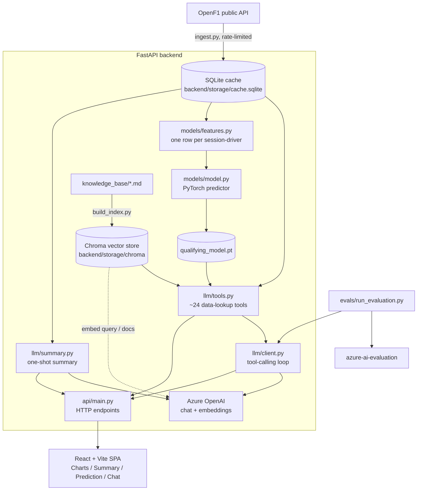

# Architecture

A technical walkthrough of how Pit Wall is put together and the reasoning
behind the main design choices. For setup instructions see the
[repository README](../../README.md); for the PyTorch model's results and
limitations see [`backend/models/README.md`](../backend/models/README.md).

## Contents

- [System overview](#system-overview)
- [Data layer](#data-layer)
- [PyTorch qualifying model](#pytorch-qualifying-model)
  - [Why embeddings, not one-hot encoding](#why-embeddings-not-one-hot-encoding)
  - [Why a feedforward net](#why-a-feedforward-net)
  - [Model architecture](#model-architecture)
  - [Training setup](#training-setup)
  - [Evaluation and explainability](#evaluation-and-explainability)
- [LLM layer](#llm-layer)
  - [Why tool calling for race data, not RAG](#why-tool-calling-for-race-data-not-rag)
  - [The chat loop](#the-chat-loop)
  - [Race summaries: a fixed task, not a conversation](#race-summaries-a-fixed-task-not-a-conversation)
- [RAG knowledge base](#rag-knowledge-base)
  - [Why Chroma, not Azure AI Search](#why-chroma-not-azure-ai-search)
- [Fine-tuning: why it comes last](#fine-tuning-why-it-comes-last)
- [Frontend](#frontend)
- [Evaluation suite](#evaluation-suite)

---

## System overview



The backend is a single FastAPI process. It has no database of its own beyond a
local SQLite file used purely as a cache of OpenF1 responses. It is **stateless**:
the frontend holds the chat conversation and sends the full history on every
request, so there is no session store to run. This is a single-user portfolio
project, and every layer is sized for that — "simplest thing that works at this
scale" is a recurring justification in the code.

---

## Data layer

`backend/data/` wraps [OpenF1](https://openf1.org), a free, unauthenticated F1
timing API.

- **`openf1_client.py`** — HTTP client with retry-and-backoff on `429`. OpenF1
  starts rate-limiting after ~30 rapid requests, so `ingest.py` also pauses
  0.5 s between per-session calls during a backfill.
- **`cache.py`** — a thin `get_or_fetch(table, key, fetch_fn)` over SQLite. Each
  OpenF1 endpoint maps to one table; a bookkeeping table records what's been
  fetched. Every later layer reads SQLite, never the network.
- **`ingest.py`** — CLI backfill: `--years`, `--session-types`, `--limit`.
- **`refresh.py`** — checks OpenF1 for newly completed sessions; run weekly by a
  GitHub Actions schedule, which carries the cache forward as a build artifact.

**Trade-off:** caching to SQLite means the app can't show a session that hasn't
been ingested, and the cache can go stale between refreshes. In exchange, the
whole app runs offline against a stable local dataset, tests are deterministic,
and there's no per-request dependency on a third-party API's availability or
rate limits.

---

## PyTorch qualifying model

`backend/models/` predicts **each driver's own best qualifying lap time in
seconds** for a given Qualifying session. Session-level answers fall out of that
for free: predicted pole time = the minimum predicted time in the session,
predicted pole-sitter = the driver holding it. That's one regression problem
instead of a regression model plus a separate classification model, and it
mirrors how a fan actually reasons about it — estimate everyone's pace, see who
comes out on top.

### Why embeddings, not one-hot encoding

Driver, team, and circuit are categorical. The obvious encoding is one-hot: one
binary column per category.

**One-hot problems here:**

- **Dimensionality.** ~40 drivers + ~12 teams + ~25 circuits ≈ 75 extra input
  columns on a dataset of only ~1,200 training rows. That's a lot of width for
  the network to fit from very little data.
- **No shared structure.** Every category is orthogonal to every other. The
  model can't express "this rookie drives like a midfield veteran" — each
  one-hot column is learned in complete isolation, and a category with few
  examples gets a poorly-estimated weight.
- **Cold start is a hard wall.** A brand-new team (Audi, Cadillac) has no column
  at all.

**An `nn.Embedding` is a lookup table of shape `(num_categories, embed_dim)` —
one learned vector per category.** Backpropagation moves each driver's vector
wherever improves predictions, so over enough sessions the vectors come to
encode latent traits (raw pace, quali-specific skill) that the network defines
for itself. Similar drivers end up with similar vectors, so evidence is shared
rather than siloed. It's the same trick word embeddings use in NLP, applied to
F1 entities.

Index 0 in each table is reserved for an explicit `<UNKNOWN>` category, which
makes cold start a soft fallback instead of a crash (see
[Training setup](#training-setup) for how that row is made useful).

**Embedding dimensions:** driver 8, team 4, circuit 6. Small on purpose —
dimension roughly tracks how much distinct latent information the category
carries and how many examples exist to learn it. Drivers vary the most and
appear the most often, so they get the widest vector; teams are few and change
slowly. These are fixed in the model constructor (not yet part of the Optuna
search) but are logged to MLflow so they're visible per run.

### Why a feedforward net

The input is a fixed-size row of tabular numbers — no sequence, no image, no
text. A feedforward net (multi-layer perceptron: `Linear → ReLU → Linear …`) is
the standard, smallest tool for "fixed-size numeric input → numeric output".

- An **RNN / Transformer** would be solving a problem this data doesn't have
  (sequence order) and would badly overfit ~1,200 rows.
- A **gradient-boosted tree** (XGBoost/LightGBM) would be a strong, defensible
  alternative for tabular data of this size. The feedforward net was chosen
  because the categorical features are the interesting part of the problem, and
  learned entity embeddings compose naturally inside a neural net — a tree would
  need the embeddings bolted on as a separate pre-processing step. It also keeps
  the project on one modelling stack (PyTorch) end to end, which is part of the
  point of the exercise.
- The **baseline** (see below) is the honest floor: a two-line practice-time
  formula that the net does not yet consistently beat on this little data. That
  result is documented rather than hidden.

### Model architecture

`QualifyingLapTimePredictor` (`backend/models/model.py`):

```
driver_idx  ─▶ Embedding(n_drivers+1, 8)  ─┐
team_idx    ─▶ Embedding(n_teams+1,   4)  ─┤
circuit_idx ─▶ Embedding(n_circuits+1, 6) ─┼─▶ concat ─▶ MLP ─▶ 1  (predicted lap time, s)
numeric[~54] ─────────────────────────────┘
```

- **Input width** = 8 + 4 + 6 + ~54 numeric features ≈ 72.
- **Hidden layers:** default `(128, 64, 32)`, each `Linear → ReLU → Dropout(0.1)`.
  The first hidden layer is wider than the input so a ~72-dim vector isn't
  immediately bottlenecked through something narrower. The numeric feature count
  grew from ~17 to ~54 over the project without the dataset growing, which is
  why the defaults moved from `(64, 32)` to three wider layers plus dropout.
- **Output:** a single `Linear(32, 1)`.
- Everything here — layer count, layer widths, dropout, learning rate, batch
  size, weight decay — is a tunable argument to `train_model()`, and
  `tune.py` searches over all of it. The defaults are a reasonable starting
  point, not a claim of optimality.

The numeric feature block (~54 columns) casts a deliberately wide net: weekend
and per-FP-session practice pace, sector-level gaps, rolling and season
qualifying form, circuit-specific history, team form, championship standings,
teammate head-to-head, weather from the last pre-qualifying practice session,
and one-hot tyre compound. `features.py` documents each and its leakage
guard.

### Training setup

**Temporal split, by session, not random.** Sessions are ordered by date; the
oldest 70 % go to train, the next 15 % to validation, the most recent 15 % to
test. Splitting *rows* randomly would put a driver's Silverstone qualifying in
train and the same weekend's teammate row in test — the model would look great
on validation and mean nothing, because the real task is predicting a session
that hasn't happened yet. Splitting by *time* makes validation and test genuine
"future" data.

**Everything learnable is fit on train only** and applied unchanged to
val/test: the category→index maps, the numeric mean/std used for
standardisation, and the baseline's offset. Hyperparameter search optimises
validation MAE and never touches test — tuning against test would be the same
leakage mistake one level up.

**Standardisation + clipping.** Numeric features are standardised, then clipped
to `[-5, 5]` in z-space. This was added after a real debugging session: one
practice lap (a likely red-flag-affected lap at Miami) had a z-score of 51 on
`practice_gap_to_best_s`, and that single row's activations blew up through the
Linear layers and wrecked a whole split's average error. Clipping leaves 99 %+
of rows untouched.

**Early stopping.** Training runs up to 200 epochs but stops if validation MAE
hasn't improved in 20, and restores the best-seen weights rather than the last
ones. On a small net and a small dataset, training loss keeps falling by
memorising training-row quirks long after validation has plateaued.

**The `<UNKNOWN>` embedding regularisation trick.** Index 0 of each embedding
table is only ever fed to the model for categories seen in val/test/live but not
in training. Without intervention that row never receives a gradient update and
stays at random initialisation forever — so a genuinely new team gets a
prediction from a random vector. The fix: during training, deliberately relabel
a fixed 10 % of rows' real driver/team/circuit to index 0, so that row learns a
sensible "no specific information" representation. This is separate from the
network's `Dropout` layers — it's category dropout on the input, at a fixed rate
regardless of tuning. (Known simplification: the mask is rolled once at
tensor-build time; resampling it every epoch would be the stronger, more
standard version.)

**Experiment tracking.** Every `train_model()` call — a plain run, each Optuna
trial, the final retrain of the winner — is one MLflow run, logging all
hyperparameters, the per-epoch validation curve, and final train/val/test
MAE and pole accuracy for both the model and the baseline. It's entirely local
(`backend/storage/mlruns/`, `mlflow ui` to browse) — no server, no Azure
resource. An Optuna sweep nests every trial under one parent run so the UI shows
one sweep, not 50 loose runs.

### Evaluation and explainability

Three complementary views, because "the model's MAE is 3.2 s" on its own says
nothing about whether that's good or *why* it's that:

1. **Baseline comparison** (`baseline.py`). The baseline predicts a driver's
   qualifying time as their practice-best time plus one learned constant offset
   (quali is faster than practice — lighter fuel, softer tyres). It "learns"
   exactly one number. If a two-line formula does nearly as well as embeddings +
   an MLP, either the net needs work or the complexity isn't earning its keep.
   Reported alongside the model for every split. Two metrics: MAE (seconds) and
   pole accuracy (does the lowest predicted time in a session belong to the
   driver who actually took pole).

2. **Permutation importance** (`importance.py`, global). For each input, shuffle
   just that column across the validation set, re-predict, and measure how much
   MAE increases. A feature the model relies on hurts a lot when scrambled; one
   it ignores barely moves the score. Uses the already-trained model as-is (no
   retraining), so it isolates "how much this model's predictions depend on this
   input" — averaged over ~10 shuffles to smooth the noise of any one random
   ordering. Exposed at `GET /api/model/feature-importance`.

3. **Captum Integrated Gradients** (`explain.py`, per-prediction). For one
   `(session, driver)`, attributes the predicted lap time to each input relative
   to a neutral baseline. Integrated Gradients walks a straight path from
   baseline to the real input and accumulates the gradient along it, which
   gives attributions that sum (up to a small error) to
   `prediction − baseline_prediction` — a built-in completeness check that the
   numbers aren't just plausible-looking noise. Attribution is done on the
   **concatenated** embedding+numeric vector in one call (you can't walk a path
   between two integer category indices; index 43.7 isn't a driver) — doing
   separate per-group calls left a ~25 % unexplained gap in testing, the joint
   version closes it. The `<UNKNOWN>` index 0 is the baseline for the
   categoricals ("what if we knew nothing about who this is"), and 0 in
   standardised space — i.e. the training mean — is the baseline for numeric
   features. Surfaced in chat via `explain_qualifying_prediction` and in the UI's
   Prediction tab.

---

## LLM layer

`backend/llm/` — the chat assistant and the race-summary generator. Both talk to
an Azure OpenAI **deployment** directly through the standard `openai` SDK's
`AzureOpenAI` client with API-key auth.

> **Connection note.** Azure Foundry also exposes a project-level endpoint
> (`.../api/projects/<name>`) meant for the newer `azure-ai-projects` SDK, built
> around Entra-ID auth and project features like agents and evaluations. For a
> plain "send messages, get tool calls back" client, talking to the deployment
> with an API key is simpler and needs no `az login`. The project endpoint is
> used only by the optional `--push-to-foundry` eval upload.

### Why tool calling for race data, not RAG

RAG makes sense when knowledge is **unstructured text** and the operation is
"find the most semantically similar chunk". Race data is the opposite:
structured, tabular, exactly queryable. "Driver 44's lap times in session 9468"
is a `WHERE` clause, not a similarity search.

If race data were embedded as text chunks and retrieved by similarity:

- Exact lookups would depend on the right chunk happening to rank in the top-k.
- Numbers would be **re-typed by the language model** from retrieved text — a
  transcription step with nothing to gain and accuracy to lose.
- Aggregations ("who gained the most positions") would need a chunk that already
  computed them, or the model doing arithmetic over prose.

Instead, ~24 tool functions (`tools.py`) each run one or two SQL/pandas
operations and return JSON. The model asks for precisely the data it needs, gets
exact values back, and reasons over them. The tools are thin and stateless —
open connection, query, close, return plain dicts. `search_knowledge_base` is
one tool among them, so the model can reach for retrieval when a question is
genuinely conceptual and SQL the rest of the time.

**Trade-off:** every tool is hand-written and hand-schema'd, and the model can
only answer what a tool exposes. In exchange, every number in an answer is
exact and traceable to a query, which is the whole point for a data assistant.

### The chat loop

`client.py::chat()` runs the standard agentic loop:

1. Send conversation + `TOOL_SCHEMAS` to the model.
2. Model replies with either a final answer or one or more tool calls (it never
   executes anything — it only asks).
3. We run the requested functions and append the results as `tool`-role
   messages. A tool that raises is caught and its error handed back as the
   result, so a bad argument doesn't kill the conversation.
4. Loop. Capped at `MAX_TOOL_ROUNDS = 5` as a safety valve against a model that
   keeps re-requesting.

The system prompt enforces the rules that matter for a data assistant:
**never state a lap time / position / gap from memory — always retrieve it
first**; name drivers with full name *and* number (numbers get reused across
careers); state the qualifying model's uncertainty plainly every time;
no betting advice; say when an answer came from the knowledge base.

Token usage, latency, and cost of every LLM call (chat and embeddings) are
logged locally by `observability.py` to a SQLite table.

### Race summaries: a fixed task, not a conversation

`summary.py` does **not** use the tool-calling loop. A recap is a fixed task —
we already know exactly what it needs (race-control events, biggest movers,
fastest lap, pit strategy, weather, final classification). So deterministic
Python gathers all of that up front, and **one** LLM call writes the narrative
from it. That's cheaper (one call, not several round trips) and more reliable —
the model can't forget to check something that's already in front of it.

The call uses **structured outputs** (`response_format` with a JSON schema) to
guarantee a `{headline, narrative}` shape back, so no fragile string-parsing.
Raw per-lap numbers never go through the model — it sees a compact summary and
the chart data is served to the UI straight from the cache.

---

## RAG knowledge base

`backend/knowledge_base/*.md` — hand-written F1 reference notes (glossary, tyre
strategy, circuit guides, regulations and race control, driver profiles). Used
only for conceptual questions ("what's an undercut", "why is Monaco hard to
overtake at"), never race data.

**Pipeline** (`backend/rag/`):

- **`chunking.py`** — one chunk per `##` section. Each knowledge-base file is
  written with one self-contained concept per section, so that's the natural
  boundary: a whole-file chunk would average several concepts into one vector
  (hurting recall); a sub-section chunk would cut an explanation in half. The
  `#` document title is prepended to every chunk so a short section still
  carries its topic.
- **`embeddings.py`** — batches all chunks into one Azure embeddings call.
- **`store.py`** — a persistent Chroma collection with **cosine** similarity
  (OpenAI-style embeddings encode meaning in direction, not magnitude; Chroma's
  default L2 is wrong for them). The index is rebuilt from scratch on every
  `build_index.py` run — the corpus is a few dozen chunks, so diffing which
  changed isn't worth the complexity.
- Retrieval returns top-k chunks with their source file and section as metadata,
  so an answer can point back to where it came from. In the eval suite,
  groundedness is checked against the chunks actually retrieved, not a
  hand-written reference — it measures the real pipeline.

### Why Chroma, not Azure AI Search

Azure AI Search is a managed, scalable vector + keyword search service — the
right tool for a large, changing corpus, hybrid ranking, or multi-tenant
production search.

This knowledge base is **small, static, and read-mostly** — a few dozen chunks
that change only when the markdown is hand-edited. For that:

| | Chroma (embedded) | Azure AI Search |
|---|---|---|
| Extra Azure resource to provision / pay for | none | yes |
| Runs offline | yes | no |
| Lives inside the repo | yes (`backend/storage/chroma/`) | no |
| Setup | `pip install chromadb` | resource creation, index schema, keys |
| Scales to millions of docs / hybrid search | no | yes |

At this corpus size the scaling advantages are irrelevant and the operational
cost is pure overhead. Chroma keeps the whole RAG path a local library call. If
the knowledge base grew into thousands of frequently-changing documents needing
hybrid ranking, Azure AI Search would become the right call — the retrieval
interface (`search_knowledge_base`) is small enough to swap behind.

---

## Fine-tuning: why it comes last

The project follows the standard escalation ladder for steering an LLM, and
deliberately stops where it currently sits:

1. **System prompt / prompt engineering** — done. Tone, grounding rules,
   driver-naming format, uncertainty framing, scope and safety are all in
   `SYSTEM_PROMPT`.
2. **Retrieval (RAG + tool calling)** — done. Structured data via tools,
   conceptual knowledge via the Chroma knowledge base.
3. **Fine-tuning** — not done, and intentionally so.

**Why this order:**

- **Cost and iteration speed.** A prompt change ships in seconds; RAG content is
  a markdown edit and a re-index. A fine-tune is a training job, a new
  deployment, an evaluation cycle, and a fixed monthly hosting cost for the
  custom model — every iteration is hours and dollars, not seconds.
- **Fine-tuning teaches behaviour, not facts.** It's the right tool for a
  consistent format or style the prompt can't reliably hold, or a
  classification the base model is weak at. It is *not* a way to inject
  knowledge — for "know these F1 facts", retrieval is both cheaper and
  auditable, and doesn't go stale the moment a race happens.
- **You can't tell what fine-tuning would fix until the first two are
  exhausted.** Most behaviours people reach for fine-tuning to fix (wrong tone,
  hallucinated numbers, ignored rules) turn out to be promptable or
  retrieval-shaped. Fine-tuning first would spend the expensive budget solving
  problems the cheap layers already handle, and obscure which problems are left.
- **Evaluation has to exist first.** Without the eval suite (below) there's no
  way to know whether a fine-tune helped or hurt. The eval suite is the
  prerequisite for step 3, not a parallel track.

The eval suite is the trigger: if it surfaced a behaviour that survived prompt
and RAG changes — a format the model won't hold, a rule it keeps breaking — that
would be the case for a fine-tune, on a dataset built from the logged
conversations. So far it hasn't.

---

## Frontend

`frontend/` — React 19 + Vite + TypeScript, Tailwind CSS v4, shadcn/ui (Radix
primitives), Recharts for the charts, TanStack Query for server state.

`App.tsx` is a race selector plus four tabs — **Charts**, **Summary**,
**Prediction**, **Chat** — each backed by one or more of the FastAPI endpoints
in `api/main.py`. The chat panel holds the full conversation client-side and
posts the whole history to `/api/chat` each turn (the backend is stateless). In
dev, Vite proxies `/api` to `localhost:8000`.

Most API endpoints call straight through to a `tools.py` function — those
already return the right JSON shape, so there's no separate API-layer logic
duplicating them.

---

## Evaluation suite

`evals/run_evaluation.py` runs the **real** chat loop against fixed test cases
(`test_cases.jsonl`) and scores the results with `azure-ai-evaluation`. Each
test case passes only if every check that applies to it passes:

| Evaluator | Runs on | Checks |
|---|---|---|
| `TaskAdherence` | every case | did the assistant address the request while following the system-prompt rules |
| `ToolCallAccuracy` + a direct "was the expected tool called" check | cases with an `expected_tool` | correct tool selection |
| `Groundedness` | the knowledge-base case | answer supported by the chunks actually retrieved |
| `GuardrailEvaluator` (custom) | cases with a `guardrail_rule` | domain rules the built-ins don't know (off-topic redirect, no betting advice) |
| substring check | the race-data case | one verifiably correct answer |

It runs in CI on changes under `backend/llm/`, `backend/rag/`,
`backend/knowledge_base/`, or `evals/`, and writes a summary table to
[`EVAL_RESULTS.md`](EVAL_RESULTS.md). `--push-to-foundry` additionally uploads
results to the Azure Foundry portal's Evaluation tab (this is the one place the
project-level endpoint and Entra-ID auth are used).
